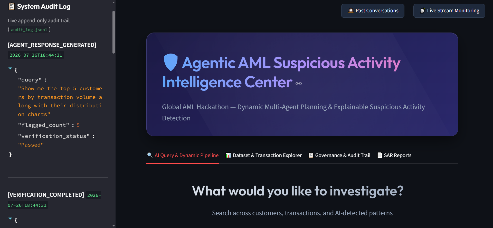
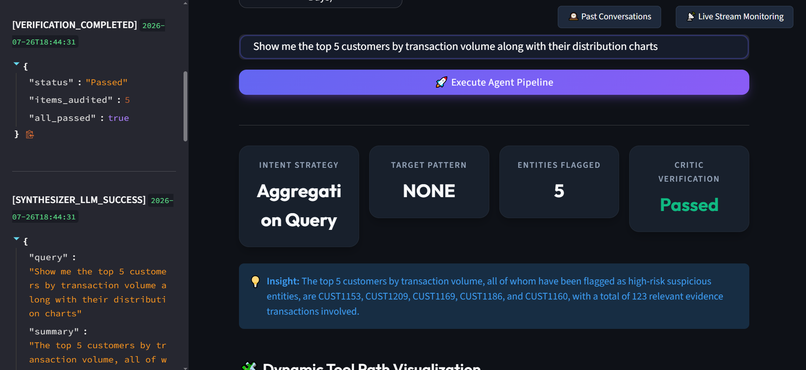
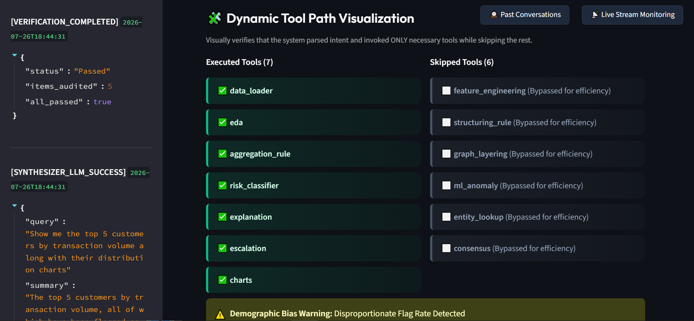
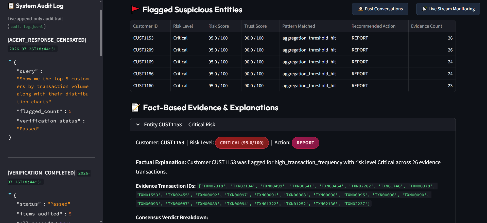
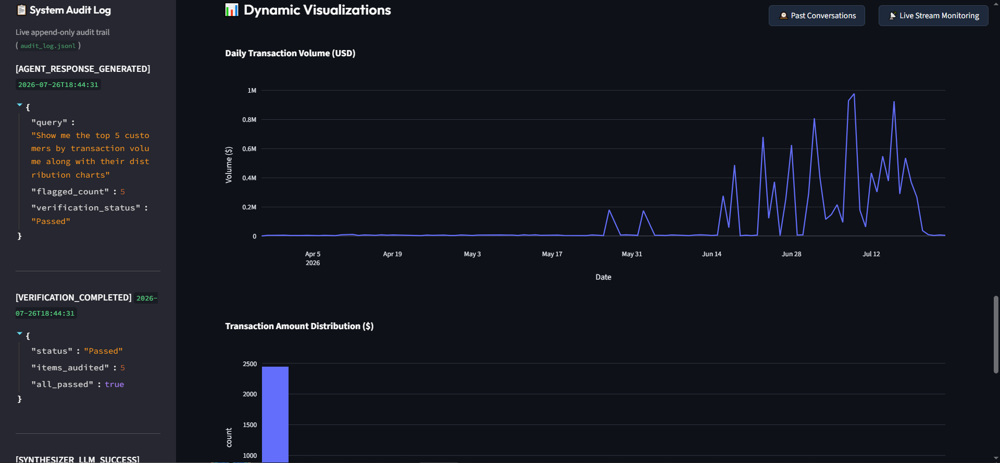
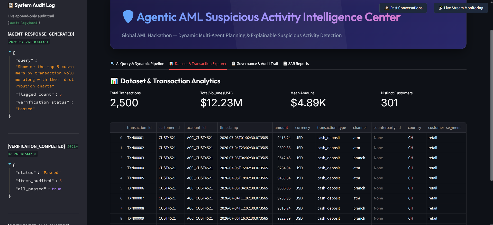
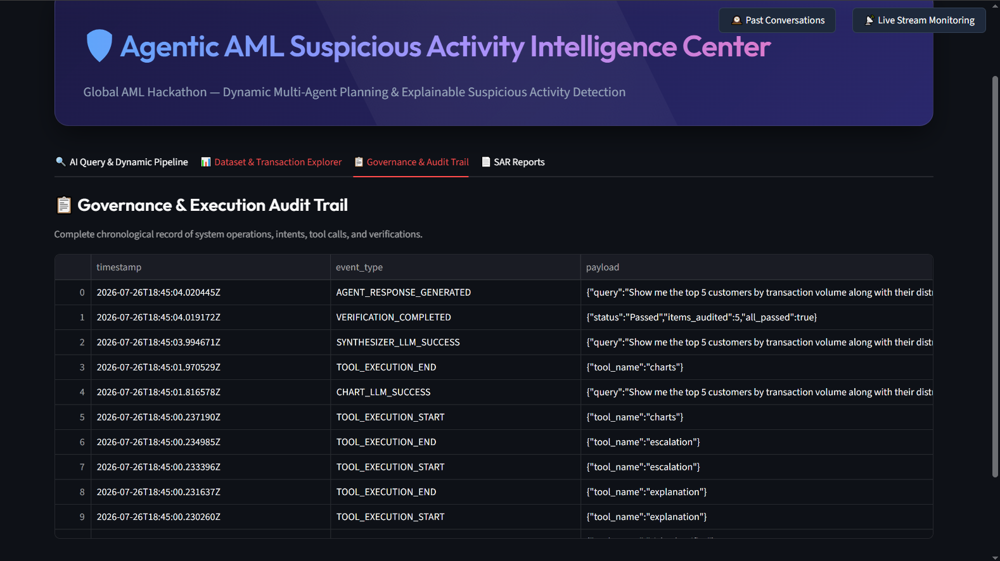
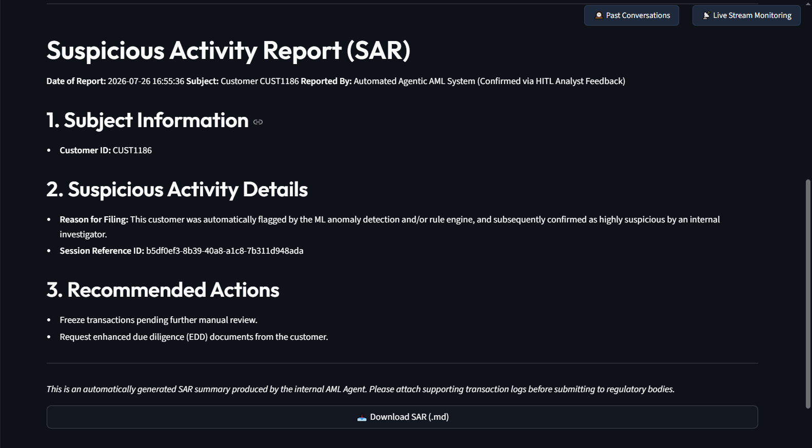
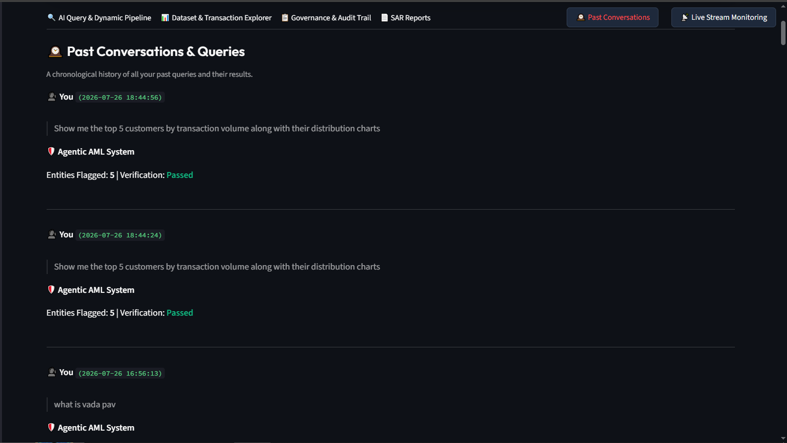
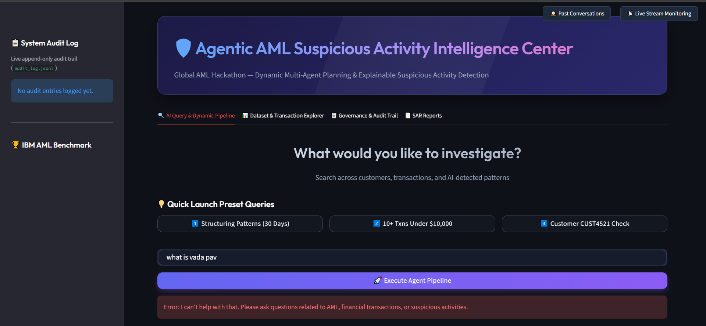

<div align="center">
  
  <h1>🛡️ Agentic AML</h1>
  <h3>The Next-Generation Agentic AI Suspicious Activity Detection System</h3>

  <p align="center">
    <b>Empowering compliance investigators with an intelligent, autonomous, and fully explainable AI co-pilot.</b>
  </p>

  [](https://www.python.org/)
  [](https://fastapi.tiangolo.com/)
  [](https://streamlit.io/)
  [](https://duckdb.org/)
</div>

<br/>

## 🎯 Problem Statement
Traditional Anti-Money Laundering (AML) systems suffer from rigid rule-based constraints, resulting in up to **95% false-positive rates** and severe alert fatigue for compliance investigators. The manual effort required to sift through thousands of false alarms drains resources, delays critical investigations, and leaves institutions vulnerable to sophisticated, multi-hop laundering typologies (like layering and smurfing) that easily evade basic heuristics.

> 🚨 **Our Solution**: **Agentic AML** solves this by dynamically routing investigations through a Multi-Agent system—combining the determinism of hard rules with the adaptability of Unsupervised ML, cutting investigation times from days to seconds while maintaining **100% regulatory explainability**.

---

## 🏆 Why This Project Wins

1. **Dynamic "Think-Then-Act" Orchestration**: It **does NOT run a fixed sequential pipeline**. The AI understands natural language, dynamically plans the execution path, and calls only the necessary tools—saving massive compute costs.
2. **Zero-Hallucination Guarantee (The Critic Agent)**: LLMs are prone to hallucinating financial figures. Our internal **Verifier Agent** mathematically cross-checks every LLM output against the local database before showing it to the user.
3. **Enterprise-Grade Security (Zero Data Exfiltration)**: Raw PII and transaction amounts are **never** sent to the LLM. The AI only receives metadata schemas to write queries and charting logic safely.
4. **Seamless Offline Failovers**: If the cloud LLM goes down, the system instantly hot-swaps to an offline regex-parser and template generator, ensuring **100% uptime for mission-critical compliance teams**.

---

## 📊 Dataset & Data Sources
This project is built and benchmarked using the **IBM AML (Anti-Money Laundering) Dataset** (synthetic banking transaction data hosted on Kaggle). 
- **Type**: Synthetic tabular transaction records.
- **Features**: Includes Sender IDs, Receiver IDs, Timestamps, Amounts, Currencies, and categorical transaction types.
- **Mock Data Generator**: To ensure the application runs smoothly out-of-the-box, the repo includes a robust synthetic data generator (`scripts/generate_sample_data.py`). It simulates high-velocity transaction streams, structuring patterns, and graph-based laundering typologies matching the IBM schema.

---

## 💻 Tech Stack
- **Backend Application**: FastAPI (Python 3.11+)
- **Frontend Dashboard**: Streamlit
- **Database Engine**: DuckDB (In-process analytical SQL engine)
- **Machine Learning**: PyOD (IsolationForest for unsupervised anomaly detection), Scikit-Learn
- **Graph Analytics**: NetworkX (for detecting multi-hop cyclic layering)
- **Data Visualization**: Plotly (Dynamically generated via autonomous charting agents)
- **Containerization**: Docker & Docker Compose
- **LLM Routing**: OpenRouter (For Intent parsing and explanation generation)

---

## 🏗️ Architecture: The Multi-Agent Hive

<div align="center">


</div>

---

## 📸 Application Showcase

<p align="center">
  
  
  
  
  
  
  
  
  
  
</p>

---

## 📂 Complete Project Structure

```text
Activity-detection/
├── agents/                      # 🧠 Autonomous AI Agents
│   ├── orchestrator.py          # The Central Nervous System (Dynamic Tool Planner)
│   ├── planner.py               # (Legacy/Helper) Builds prompt structures for the LLM
│   ├── query_understanding.py   # Intent Parser (Extracts filters, entities, and actions)
│   └── synthesizer.py           # Natural Language Generation for the final response
├── tools/                       # 🛠️ The Execution Tool Suite
│   ├── aggregation_rule.py      # Statistical volume anomalies (e.g., 10+ txns in 24h)
│   ├── charts.py                # AI-driven Plotly code generator for dynamic visuals
│   ├── eda.py                   # Exploratory Data Analysis & summary statistics
│   ├── explanation.py           # Evidence-backed natural language explanations
│   └── ml_anomaly.py            # PyOD IsolationForest unsupervised ML models
├── api/                         # 🌐 FastAPI Backend Services
│   └── main.py                  # The REST API exposing the /agent/query endpoint
├── dashboard/                   # 🖥️ Streamlit Frontend
│   └── app.py                   # Real-time UI, Chat Interface, and Audit Log Viewer
├── data/                        # 🗄️ Database
│   └── mock_aml_database.db     # DuckDB database holding the financial transactions
├── safety/                      # 🛡️ Enterprise Security & Guardrails
│   ├── audit_logger.py          # Immutable logging to audit_log.jsonl
│   ├── fallback_handler.py      # Regex & Deterministic failovers for LLM outages
│   └── verifier.py              # Critic Agent preventing numerical LLM hallucinations
├── sars/                        # 📄 Suspicious Activity Reports
│   └── SAR_*.md                 # Auto-generated draft SARs for human review
├── scripts/                     # ⚙️ Utility Scripts
│   ├── backtest_ibm_dataset.py  # Kaggle IBM AML supervised ML backtesting
│   ├── generate_sample_data.py  # Synthesizes the mock banking transactions
│   └── stream_processor.py      # Daemon simulator for continuous transaction ingest
├── config.py                    # Environment configuration & Thresholds
├── schemas.py                   # Pydantic data models enforcing strict types
└── README.md                    # You are here!
```

---

## 🤖 The Agents & Tools Breakdown

### 🧠 Core Agents (The Brain)
- **`Query Understanding Agent` (`agents/query_understanding.py`)**: 
  - Converts messy natural language into a strict Pydantic `Intent` schema. 
  - Identifies exactly what the user wants: an isolated entity lookup (`"Is CUST123 suspicious?"`), a broad ML sweep (`"Find structuring"`), an aggregation query (`"Show top 5"`), or a charting request (`"Plot amounts"`).
- **`Orchestrator Agent` (`agents/orchestrator.py`)**: 
  - The central nervous system and dynamic execution planner. 
  - It decides precisely which tools to run and which to skip based on the intent. If a user asks for a chart, it skips the heavy ML Anomaly models to save compute and time.
- **`Verifier Agent` (`safety/verifier.py`)**: 
  - The strict internal auditor (Critic Agent). 
  - Mathematically cross-verifies the LLM's natural language responses against the local Pandas dataframe. If the LLM hallucinates an amount or transaction count, this agent strips it out and enforces ground-truth facts.

### 🛠️ Tool Suite (The Hands)
- **`data_loader` & `feature_engineering`**: 
  - Connects to DuckDB to ingest data dynamically filtered by the Query Agent's timebounds.
  - Calculates complex temporal rolling velocity windows (e.g., `avg_amount_7d`, `daily_txn_count`) necessary for catching layered structuring.
- **`structuring_rule`**: 
  - A deterministic heuristics engine. 
  - Flags behaviors like "smurfing"—where a criminal makes multiple rapid deposits just under the $10,000 IRS reporting threshold to avoid raising alarms.
- **`aggregation_rule` (`tools/aggregation_rule.py`)**: 
  - Flags massive volume anomalies (e.g., customers conducting 50+ rapid-fire retail transactions in a single day).
- **`graph_layering`**: 
  - Uses `NetworkX` to construct directed transactional graphs. 
  - Follows the money through multiple hops to detect cyclical layering chains (e.g., Account A -> B -> C -> A).
- **`ml_anomaly` (`tools/ml_anomaly.py`)**: 
  - Runs a totally unsupervised `IsolationForest` (via PyOD library).
  - Designed to catch statistically bizarre multivariate patterns that humans and hard-coded rules cannot see.
- **`consensus`**: 
  - A weighted voting engine combining strict rules with ML intuition. Outputs a unified Risk Score (0-100) and an agreement verdict (e.g., `Full agreement`, `Disagreement`).
- **`charts` (`tools/charts.py`)**: 
  - An entirely autonomous, sandboxed sub-agent. 
  - It receives the user's charting request and the dataset schema, then dynamically writes and safely executes Python `Plotly` code on the fly to render bespoke, interactive visuals in the UI.

---

## 🤝 Human-in-the-Loop (HITL)

We believe AI should act as a **co-pilot, not an autopilot**. 
- The system drafts **Suspicious Activity Reports (SARs)** for review (saved to `sars/`).
- It outputs strict evidence (exact Transaction IDs) allowing investigators to manually cross-reference the data grid.
- The final escalation verdict ("File SAR", "Monitor") is merely a recommendation, leaving the ultimate regulatory and legal decision securely in the hands of human compliance officers.

---

## 🔒 Enterprise-Grade Security & Safety

- **No Data Exfiltration**: Raw transaction data, balances, and PII are **never** sent to the LLM. 
- **Code Execution Sandbox**: The charting agent generates Python code dynamically, but executes it in a highly restricted `local_scope`, preventing access to the OS or network.
- **Immutable Audit Logging**: Every query, intent parsed, tool called, and ML score generated is cryptographically appended to a local `audit_log.jsonl` to perfectly satisfy banking regulatory audits.

---

## 🚀 Installation & Quick Start

Ready to run the winning system? Follow these steps:

### 1. Prerequisites
- **Python 3.11+** installed on your system.
- Git.

### 2. Clone the Repository
```bash
git clone https://github.com/Shivam2005Goel/Activity-detection.git
cd Activity-detection
```

### 3. Install Dependencies
```bash
pip install -r requirements.txt
```

### 4. Generate the Synthetic Transaction Dataset
Before running the app, populate the local DB:
```bash
python scripts/generate_sample_data.py
```

### 5. Configure API Keys (Optional but Recommended)
For dynamic Intent Parsing and Charting, the system uses OpenRouter LLMs.
```bash
# On Windows
set OPENROUTER_API_KEY=your_openrouter_api_key_here

# On Linux / macOS
export OPENROUTER_API_KEY=your_openrouter_api_key_here
```
*(If no key is set, the system seamlessly uses an offline regex parser and template explainability engine!)*

### 6. Run the FastAPI Backend Service
```bash
uvicorn api.main:app --port 8000 --reload
```

### 7. Launch the Streamlit Dashboard
Open a new terminal and run:
```bash
streamlit run dashboard/app.py
```
*(The beautiful dashboard will open at `http://localhost:8501`)*

---

## 🐳 Docker Deployment (Recommended)

The easiest and most robust way to run the entire system (both the backend API and the frontend UI) is using Docker Compose.

### 1. Clone & Setup Environment
```bash
git clone https://github.com/Shivam2005Goel/Activity-detection.git
cd Activity-detection

# Create an .env file with your API key
echo "OPENROUTER_API_KEY=your_openrouter_key" > .env
```

### 2. Spin Up the Containers
```bash
docker-compose up -d --build
```

That's it! The system will automatically build the environments, generate the mock DuckDB database on startup if it's missing, and link the services together securely. 
- **Dashboard**: `http://localhost:8501`
- **API**: `http://localhost:8000`

---

## 💡 "Show, Don't Tell": Try These Queries!

- **`"Show me a scatter plot of transaction amounts vs time"`**  
  *Watch the agent write Python code to dynamically generate a Plotly chart!*
- **`"Find structuring patterns in the last 30 days"`**  
  *Watch the orchestrator skip ML Anomaly and jump straight to Structuring Rules!*
- **`"Is customer ID CUST1237 suspicious?"`**  
  *Watch the system perform an isolated entity lookup, bypassing broad sweeps to save compute!*

---

## 🧪 Automated Testing & Benchmarking

Run the automated `pytest` suite:
```bash
pytest tests/ -v
```

We also support offline benchmarking using the IBM AML Kaggle dataset (download it to the `data/` folder first):
```bash
python scripts/backtest_ibm_dataset.py
```

---

## 📚 References & Documentation
- **IBM AML Dataset (Kaggle)**: [Synthetic Financial Datasets For Fraud Detection](https://www.kaggle.com/) (Reference for backtesting suite)
- **FastAPI Documentation**: [https://fastapi.tiangolo.com/](https://fastapi.tiangolo.com/)
- **Streamlit Documentation**: [https://docs.streamlit.io/](https://docs.streamlit.io/)
- **DuckDB Documentation**: [https://duckdb.org/docs/](https://duckdb.org/docs/)
- **PyOD (Python Outlier Detection)**: [https://pyod.readthedocs.io/](https://pyod.readthedocs.io/)
- **NetworkX**: [https://networkx.org/](https://networkx.org/)

<div align="center">
  <br/>
  <b>Built with ❤️ for the Global AML Hackathon</b>
</div>