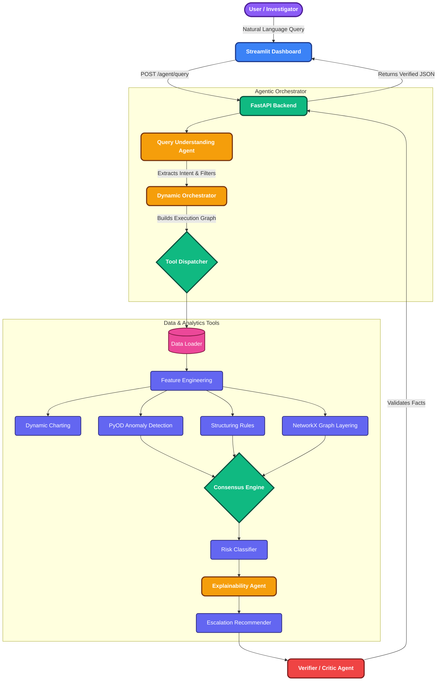

<div align="center">
  
  <h1>🛡️ Agentic AML</h1>
  <h3>The Next-Generation Agentic AI Suspicious Activity Detection System</h3>

  <p align="center">
    <b>Empowering compliance investigators with an intelligent, autonomous, and fully explainable AI co-pilot.</b>
  </p>

  [](https://www.python.org/)
  [](https://fastapi.tiangolo.com/)
  [](https://streamlit.io/)
  [](https://duckdb.org/)
</div>

<br/>

> 🚨 **The Impact**: Traditional Anti-Money Laundering (AML) systems suffer from rigid rule-based constraints, resulting in up to **95% false-positive rates** and severe alert fatigue. **Agentic AML** solves this by dynamically routing investigations through a Multi-Agent system—combining the determinism of hard rules with the adaptability of Unsupervised ML, cutting investigation times from days to seconds while maintaining **100% regulatory explainability**.

---

## 🏆 Why This Project Wins

1. **Dynamic "Think-Then-Act" Orchestration**: It **does NOT run a fixed sequential pipeline**. The AI understands natural language, dynamically plans the execution path, and calls only the necessary tools—saving massive compute costs.
2. **Zero-Hallucination Guarantee (The Critic Agent)**: LLMs are prone to hallucinating financial figures. Our internal **Verifier Agent** mathematically cross-checks every LLM output against the local database before showing it to the user.
3. **Enterprise-Grade Security (Zero Data Exfiltration)**: Raw PII and transaction amounts are **never** sent to the LLM. The AI only receives metadata schemas to write queries and charting logic safely.
4. **Seamless Offline Failovers**: If the cloud LLM goes down, the system instantly hot-swaps to an offline regex-parser and template generator, ensuring **100% uptime for mission-critical compliance teams**.

---

## 🏗️ Architecture: The Multi-Agent Hive

<div align="center">


</div>

---

## 🤖 The Agents & Tools Breakdown

### 🧠 Core Agents (The Brain)
- **`Query Understanding Agent`**: Converts natural language into a structured schema, determining if the user wants an entity lookup, a broad ML sweep, or a dynamic chart.
- **`Orchestrator Agent`**: The central nervous system. Decides which tools to run and which to skip.
- **`Verifier Agent`**: The strict auditor. Mathematically verifies LLM responses against local data arrays. If an LLM hallucinates an amount, this agent blocks it.

### 🛠️ Tool Suite (The Hands)
- **`data_loader` & `feature_engineering`**: Ingests data and calculates rolling velocity windows (e.g., `avg_amount_7d`).
- **`structuring_rule`**: Deterministically flags behaviors like "smurfing" (multiple rapid deposits just under the $10k IRS reporting threshold).
- **`graph_layering`**: Uses NetworkX to build directed graphs, detecting cyclical layering chains.
- **`ml_anomaly`**: Runs unsupervised `IsolationForest` (PyOD) to catch statistically bizarre multivariate patterns that humans can't see.
- **`consensus`**: A weighted voting engine combining strict rules with ML intuition.
- **`charts`**: A sandboxed agent that dynamically writes and executes Plotly Python code on the fly to render bespoke visualizations.

---

## 🤝 Human-in-the-Loop (HITL)

We believe AI should act as a **co-pilot, not an autopilot**. 
- The system drafts **Suspicious Activity Reports (SARs)** for review (saved to `sars/`).
- It outputs strict evidence (exact Transaction IDs) allowing investigators to manually cross-reference the data grid.
- The final escalation verdict ("File SAR", "Monitor") is merely a recommendation, leaving the ultimate regulatory and legal decision securely in the hands of human compliance officers.

---

## 🔒 Enterprise-Grade Security & Safety

- **No Data Exfiltration**: Raw transaction data, balances, and PII are **never** sent to the LLM. 
- **Code Execution Sandbox**: The charting agent generates Python code dynamically, but executes it in a highly restricted `local_scope`, preventing access to the OS or network.
- **Immutable Audit Logging**: Every query, intent parsed, tool called, and ML score generated is cryptographically appended to a local `audit_log.jsonl` to perfectly satisfy banking regulatory audits.

---

## 🚀 Installation & Quick Start

Ready to run the winning system? Follow these steps:

### 1. Prerequisites
- **Python 3.11+** installed on your system.
- Git.

### 2. Clone the Repository
```bash
git clone https://github.com/Shivam2005Goel/Activity-detection.git
cd Activity-detection
```

### 3. Install Dependencies
```bash
pip install -r requirements.txt
```

### 4. Generate the Synthetic Transaction Dataset
Before running the app, populate the local DB:
```bash
python scripts/generate_sample_data.py
```

### 5. Configure API Keys (Optional but Recommended)
For dynamic Intent Parsing and Charting, the system uses OpenRouter LLMs.
```bash
# On Windows
set OPENROUTER_API_KEY=your_openrouter_api_key_here

# On Linux / macOS
export OPENROUTER_API_KEY=your_openrouter_api_key_here
```
*(If no key is set, the system seamlessly uses an offline regex parser and template explainability engine!)*

### 6. Run the FastAPI Backend Service
```bash
uvicorn api.main:app --port 8000 --reload
```

### 7. Launch the Streamlit Dashboard
Open a new terminal and run:
```bash
streamlit run dashboard/app.py
```
*(The beautiful dashboard will open at `http://localhost:8501`)*

---

## 💡 "Show, Don't Tell": Try These Queries!

- **`"Show me a scatter plot of transaction amounts vs time"`**  
  *Watch the agent write Python code to dynamically generate a Plotly chart!*
- **`"Find structuring patterns in the last 30 days"`**  
  *Watch the orchestrator skip ML Anomaly and jump straight to Structuring Rules!*
- **`"Is customer ID CUST1237 suspicious?"`**  
  *Watch the system perform an isolated entity lookup, bypassing broad sweeps to save compute!*

---

## 🧪 Automated Testing & Benchmarking

Run the automated `pytest` suite:
```bash
pytest tests/ -v
```

We also support offline benchmarking using the IBM AML Kaggle dataset (download it to the `data/` folder first):
```bash
python scripts/backtest_ibm_dataset.py
```

<div align="center">
  <br/>
  <b>Built with ❤️ for the Societe Generale AML Hackathon</b>
</div>